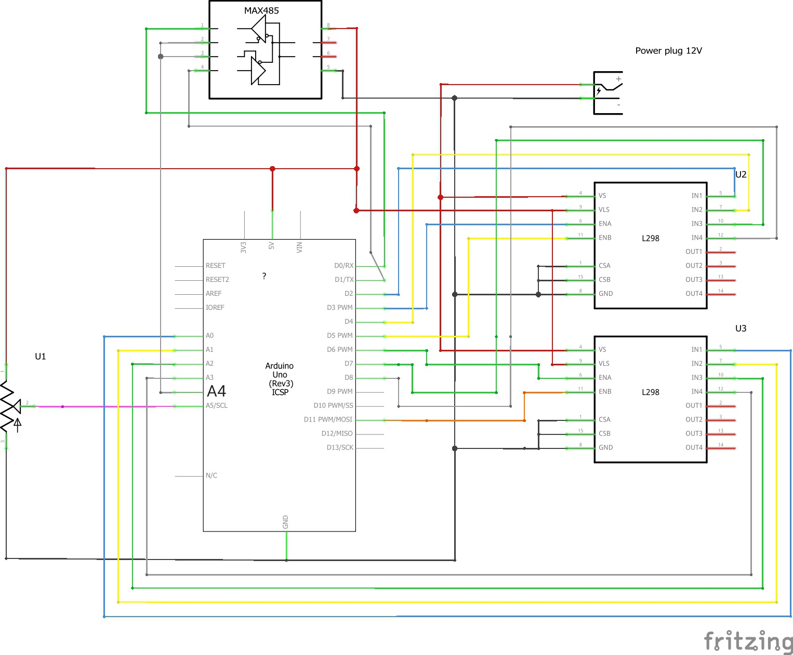

# PCM_Modbus
Pump Control Module over modbus

This program uses other open source software. Some of the libraries used have been modified to reduce size and/or add functionality to the sketch. Currently only supporting Atmega328p and ATmega32u4 microcontrollers. Special Thanks to mc68k over at sciencemadness.org for the initial motivations and ideas for this project. Full details can be found at [ScienceMadness.org](https://www.sciencemadness.org/whisper/viewthread.php?tid=159931)

# Credits 
- Arduino Stepper library
- Arduino Servo library
- [ModbusRTUSlave library by C. M. Bulliner](https://github.com/CMB27/ModbusRTUSlave)

# Wiring

# 2023-12-29
- Additional features added.
  - New Motor class model to simplify implementation and option to bypass default motor handler.
  - System uptime counter.
  - Available memory display has been improved
  - New timer implementation increased loop speed
- BugFix
  - Reboot when using servos fixed.
